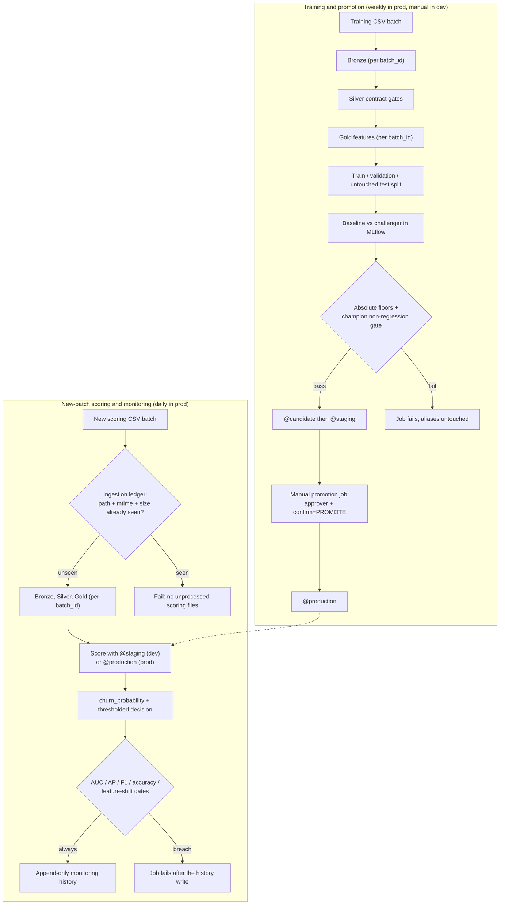
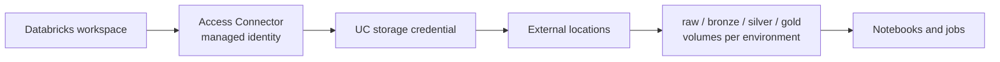

# Azure Databricks Lakehouse MLOps

[](https://github.com/danakim1004au-prog/databricks-lakehouse-mlops/actions/workflows/ci.yml)
[](https://github.com/danakim1004au-prog/databricks-lakehouse-mlops/actions/workflows/codeql.yml)
[](LICENSE)

A telco customer-churn project on Azure Databricks that I built to behave like a system you could
operate, not a notebook demo. Training and new-batch scoring run as separate lifecycles. The model
is registered in Unity Catalog as a probability model, promotion to `@production` needs a named
approver, and every scored row records enough lineage to reproduce it: the batch, the job run, the
model version, the Gold Delta snapshot and the decision threshold.

The data is synthetic, so the model itself proves nothing. What I care about is the machinery
around it: contract gates that fail loudly instead of coercing bad values, an ingestion ledger
that stops a schedule re-scoring the same file forever, managed-identity storage access with no
account keys anywhere, and schedules that are paused in dev so a forgotten deploy doesn't bill me
overnight.

## Architecture

Two lanes, deliberately. The retraining job never scores its own training data, and the scheduled
scoring job has no path to `@production`.


The same two lanes as source-controlled diagrams, so they stay in step with the code:



Storage access is managed identity end to end:



One honest caveat about the monitoring lane: real churn labels arrive weeks after scoring. The
synthetic scoring batch ships with labels so the whole control loop is reproducible in a single
run, and the notebooks mark where the day-0 scoring / day-N label-join boundary would sit in a
real system.

## What every scored batch records

| Field | Why it's there |
|---|---|
| `batch_id`, `job_run_id`, `environment` | Identify the data and the orchestrator run |
| `model_name`, `model_alias`, `model_version`, `model_run_id` | Reproduce the exact model |
| `gold_delta_version` | Anchor the input Delta snapshot |
| `decision_threshold` | Reproduce the operational class decision |
| `churn_probability`, `churn_prediction` | Rank customers and change thresholds without retraining |
| `scored_ts`, `monitored_ts` | Audit when scoring and monitoring happened |

## Repository layout

| Path | Purpose |
|---|---|
| `infra/main.bicep` | ADLS Gen2, Premium workspace, Access Connector, shared-key disablement |
| `infra/databricks/` | Metastore assignment, managed-identity credential, UC locations, volumes, grants |
| `databricks.yml` | Environment-isolated bundle targets and variables |
| `resources/churn_jobs.yml` | Retraining, scoring/monitoring, and manual promotion jobs |
| `src/databricks_lakehouse_mlops/` | Shared Pandas/Spark contracts and feature transforms |
| `notebooks/01...07` | Versioned ingest through to explicit production promotion |
| `data/generate_churn_data.py` | Seeded, distinct training and shifted scoring batches |
| `tests/` | Failure-path, feature-contract, Spark, and bundle safety tests |
| `.github/workflows/` | CI, CodeQL, dependency audit, IaC checks, optional bundle validation |
| `serving/databricks.yml` | Optional environment-tagged scale-to-zero endpoint |
| `docs/COST_ESTIMATE.md` | Cost assumptions and recurring-spend traps |

## Local quality gate

You need Python 3.10 or newer, plus Java 17 for the local Spark contract tests.

```bash
python3 -m venv .venv
source .venv/bin/activate
python -m pip install --upgrade pip
python -m pip install -r requirements-dev.lock
python -m pip install -e . --no-deps

python data/generate_churn_data.py
python -m pytest
python src/train_local.py
ruff check .
pip-audit -r requirements-dev.lock
```

The generated CSVs are gitignored because both batches are deterministic from their seeds.
`requirements-dev.lock` pins the direct CI dependencies; Dependabot proposes reviewed updates.

### Deterministic local reference result

The seeded local smoke run on Python 3.12 produced the numbers below. Treat them as sanity
evidence, not a performance claim. Databricks MLflow is the source of record for workspace runs.

| Input/result | Value |
|---|---:|
| Training raw / deduplicated customers | 10,100 / 10,000 |
| Scoring raw / deduplicated customers | 2,525 / 2,500 |
| Selected candidate | Standardised logistic regression |
| Untouched-test ROC-AUC | 0.7865 |
| Untouched-test average precision | 0.6412 |
| Untouched-test F1 at threshold 0.50 | 0.5518 |

## 1. Deploy Azure resources

```bash
az login
./infra/deploy.sh
```

The Bicep deployment creates a disposable resource group, ADLS Gen2 containers, a Premium
workspace and an Access Connector. Storage shared-key authentication is disabled at the account
level, so all data access goes through the Unity Catalog managed identity.

## 2. Bootstrap Unity Catalog

You need an existing regional Unity Catalog metastore and account-admin access. Copy the example
variables, fill in the Bicep outputs and account identifiers, then apply the Databricks layer:

```bash
cd infra/databricks
cp terraform.tfvars.example terraform.tfvars
terraform init
terraform fmt -check
terraform plan
terraform apply
cd ../..
```

[`infra/databricks/README.md`](infra/databricks/README.md) describes the security boundary this
creates. In a long-lived tenancy you'd want separate principals and remote Terraform state; for a
disposable lab, local state is a deliberate trade-off.

## 3. Generate and upload distinct batches

Authenticate to the workspace with browser OAuth, then upload the two files to the raw external
volume. Only repeat this for `churn_prod` when you actually mean to test production.

```bash
databricks auth login --host https://<workspace-url> --profile churn-lab
export DATABRICKS_CONFIG_PROFILE=churn-lab

python data/generate_churn_data.py
databricks fs cp data/telco_churn_train.csv \
  dbfs:/Volumes/churn_mlops/churn_dev/raw/training/telco_churn_train.csv --overwrite
databricks fs cp data/telco_churn_scoring.csv \
  dbfs:/Volumes/churn_mlops/churn_dev/raw/scoring/telco_churn_scoring.csv --overwrite
```

## 4. Validate, deploy and train

Every bundle command needs a fully qualified Unity Catalog model name and a real notification
address.

```bash
databricks bundle validate -t dev \
  --var="catalog=churn_mlops" \
  --var="model_name=churn_mlops.churn_dev.churn_classifier" \
  --var="notification_email=<your-email>"

databricks bundle deploy -t dev \
  --var="catalog=churn_mlops" \
  --var="model_name=churn_mlops.churn_dev.churn_classifier" \
  --var="notification_email=<your-email>"

databricks bundle run -t dev churn_retraining \
  --var="catalog=churn_mlops" \
  --var="model_name=churn_mlops.churn_dev.churn_classifier" \
  --var="notification_email=<your-email>"
```

Model selection uses validation ROC-AUC only. The untouched test set then has to clear ROC-AUC,
average precision and F1 floors, and can't regress materially against the current production
champion. A passing candidate updates `@candidate` and `@staging`. It never touches `@production`.

## 5. Score a new batch and monitor

```bash
databricks bundle run -t dev churn_batch_monitoring \
  --var="catalog=churn_mlops" \
  --var="model_name=churn_mlops.churn_dev.churn_classifier" \
  --var="notification_email=<your-email>"
```

Dev scores with `@staging`, prod with `@production`. Each run writes to an isolated batch path.
Monitoring appends AUC, average precision, F1, accuracy, positive rate and the maximum
standardised feature-mean shift. A breached gate still writes the history row first, then fails
the job and triggers notifications, so failed runs stay auditable.

The ingestion ledger rejects any source file whose path, modification time and size have already
been processed. Without it, a daily schedule pointed at a stale file would happily append the
same monitoring results forever. Upload a new dated file, or replace the scoring object, before
the next scheduled run.

## 6. Explicit production promotion

The promotion job has no schedule. It wants both an approver and a literal confirmation token,
checks that the staging version has a passing gate record, moves `@production`, and appends a
promotion audit record.

```bash
databricks bundle run -t dev churn_model_promotion \
  --params approved_by=<reviewer>,confirm=PROMOTE \
  --var="catalog=churn_mlops" \
  --var="model_name=churn_mlops.churn_dev.churn_classifier" \
  --var="notification_email=<your-email>"
```

For a real production release, deploy the `prod` target with
`churn_mlops.churn_prod.churn_classifier`, retrain and gate in that environment, and approve
there. Dev and prod get separate data paths, aliases, experiments and schedules, so one can't
clobber the other.

## Optional real-time serving

After approval, resolve the numeric version currently carrying `@production` and deploy the
separate serving bundle with that number. I pin the numeric version on purpose: an endpoint that
tracks an alias can change model underneath you, and rollback stops being explicit.

```bash
cd serving
databricks bundle deploy -t prod \
  --var="registered_model_name=churn_mlops.churn_prod.churn_classifier" \
  --var="model_version=<production-version>"
```

The endpoint is Small, environment-tagged and scales to zero. Destroy it after the demo. Serving
bills separately from job compute and it is easy to forget.

## Quality, security and cost controls

CI runs the actual Spark transform functions, not a pandas imitation of them. The shared
transform package exists because the local mirror and the notebooks drifted apart once before (a
pandas dtype difference that only surfaced on the cluster), and I'd rather not debug that twice.

The Silver layer is strict on purpose. Invalid churn labels, unknown contract values, negative
numerics, missing schema columns and conflicting duplicates all fail the run before Gold. The old
behaviour of mapping anything that wasn't "Yes" to 0 was quietly turning typos into non-churners.

Elsewhere:

- Jobs retry transient ingest and transform failures, and send duration and failure notifications.
- GitHub Actions are SHA-pinned. CodeQL, Dependabot, `pip-audit` and a coverage floor are enabled.
- Dev schedules are paused. Prod enables daily scoring and weekly retraining explicitly.
- Managed identity and UC volumes replace storage keys. Public networking stays a documented lab
  toggle, not an implied production default.
- Predictions are immutable per batch. Monitoring and promotion histories are append-only.

## Evidence and current limitations

| Compute | Bronze | Gold |
|---|---|---|
|  |  |  |

| MLflow | Registry | Batch inference |
|---|---|---|
|  |  |  |

| Bundle workflow |
|---|
|  |

Being upfront: these screenshots are from the earlier storage-key version of this lab. They show
the pipeline ran end to end in Azure, but the managed-identity rebuild hasn't been re-run in a
live workspace yet, and I'll refresh them once it has.

Other known gaps: monitoring uses labelled synthetic batches and a simple standardised mean
shift. A production system would add delayed-label orchestration, segment-level drift,
calibration checks, fairness review, alert routing, retention policies and private networking.

## Teardown

Destroy optional serving first, then the bundle-managed resources, then the resource group:

```bash
databricks bundle destroy -t dev \
  --var="catalog=churn_mlops" \
  --var="model_name=churn_mlops.churn_dev.churn_classifier" \
  --var="notification_email=<your-email>"
RG=rg-dbx-churn-lab-aue ./infra/teardown.sh
az group exists --name rg-dbx-churn-lab-aue
```

Read [`docs/COST_ESTIMATE.md`](docs/COST_ESTIMATE.md) and [`SECURITY.md`](SECURITY.md) before
unpausing a target or leaving an endpoint deployed.
