# Databricks Lakehouse MLOps — Customer Churn Prediction

End-to-end **Azure Databricks + Azure ML** portfolio project implementing the patterns most
requested in 2026 data engineering / ML engineering job descriptions:

- **Medallion architecture** (Bronze → Silver → Gold) on **Delta Lake**
- **PySpark** ETL with data-quality gates
- **MLflow** experiment tracking, model registry, and batch inference
- **Unity Catalog**-ready storage layout (ADLS Gen2 + Access Connector)
- **Infrastructure as Code** (Bicep) with same-day deploy → capture → teardown workflow
- Cost-conscious single-node cluster design (~AUD 5–10 per lab session)

## Architecture

```
                       Azure Databricks (Premium)
┌──────────┐   ┌────────────────────────────────────────────┐   ┌─────────────┐
│ Synthetic │   │  Bronze        Silver         Gold         │   │   MLflow    │
│ telco CSV ├──▶│  raw ingest ─▶ clean/dedupe ─▶ features ───┼──▶│ train/track │
│ (ADLS g2) │   │  Delta         Delta + DQ     Delta        │   │  registry   │
└──────────┘   └────────────────────────────────────────────┘   └──────┬──────┘
                                                                       │
                                                          batch inference ▶ Gold
```

## Repo layout

| Path | Purpose |
|---|---|
| `infra/main.bicep` | ADLS Gen2 + Databricks workspace (Premium) + UC Access Connector |
| `infra/deploy.sh` | One-command deploy (resource group `rg-dbx-churn-lab-aue`) |
| `infra/teardown.sh` | One-command full teardown |
| `data/generate_churn_data.py` | Synthetic telco churn dataset generator (10,000 rows, seeded) |
| `notebooks/01_bronze_ingest.py` | CSV → Bronze Delta (schema-on-read, ingest metadata columns) |
| `notebooks/02_silver_clean.py` | Dedupe, type casting, null handling, DQ assertions |
| `notebooks/03_gold_features.py` | Feature engineering (tenure buckets, spend ratios, encodings) |
| `notebooks/04_train_mlflow.py` | Gradient boosting + logistic baseline, MLflow tracking + registry |
| `notebooks/05_batch_inference.py` | Load registered model, score Gold table, write predictions |
| `src/train_local.py` | Local sklearn mirror of notebook 04 — CI-friendly smoke test |
| `tests/test_data_quality.py` | pytest data-quality checks on the generated dataset |
| `docs/dbx-*.png` | Lab evidence screenshots from a real Azure run (see gallery below) |
| `docs/COST_ESTIMATE.md` | Per-session cost breakdown |

## Quick start

```bash
# 1. Generate the dataset locally
python3 data/generate_churn_data.py            # writes data/telco_churn.csv

# 2. Run the local training smoke test (no Azure required)
python3 src/train_local.py

# 3. Deploy Azure resources
./infra/deploy.sh

# 4. In the Databricks workspace: upload data/telco_churn.csv to the raw container,
#    import notebooks/, attach a single-node cluster, run 01 → 05 in order.

# 5. Tear down everything
./infra/teardown.sh
```

### Cluster requirements (learned the hard way)

- **Access mode: Dedicated (single user)** — Shared/Serverless modes block runtime
  `spark.conf.set("fs.azure.account.key...")` storage-key auth (`CONFIG_NOT_AVAILABLE`).
- **Databricks Runtime ML** (e.g. 14.3 LTS ML) for notebooks 04–05 — bundles a
  conflict-free mlflow + scikit-learn. Plain runtime + `%pip install` hits a
  `typing_extensions`/`Sentinel` dependency clash.
- On Unity Catalog clusters, tables are read/written **by Delta path**, not via
  `CREATE TABLE ... LOCATION 'abfss://...'` (which needs a UC External Location).

## Why these choices (interview talking points)

- **Delta over plain Parquet**: ACID merge for dedupe in Silver, time travel for audit,
  `OPTIMIZE`/`VACUUM` story for cost control.
- **MLflow registry over ad-hoc pickle files**: model lineage, version aliases
  (`@staging` / `@production` under Unity Catalog), reproducible runs with logged
  params/metrics/artifacts.
- **Single-node cluster**: at 10k rows a multi-node cluster is waste; demonstrates
  cost-awareness employers explicitly screen for.
- **Local sklearn mirror (`src/train_local.py`)**: the same feature/label contract runs in CI
  without a Spark cluster — cheap regression safety net.

## Lab evidence

Screenshots from a real same-day Azure run (`australiaeast`), torn down immediately after capture.

### Infrastructure (Azure Portal)

| Resource group overview | Bicep deployment success | ADLS Gen2 medallion containers |
|---|---|---|
| 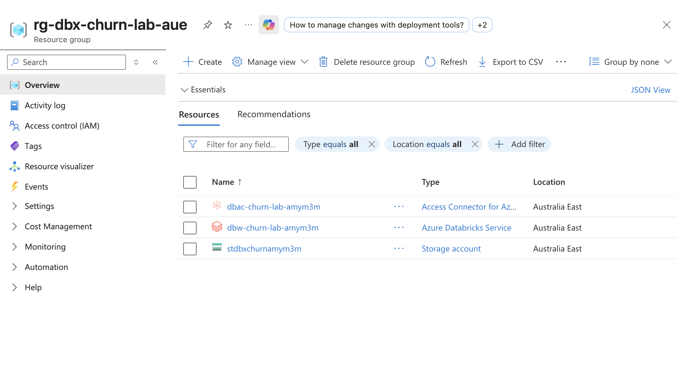 | 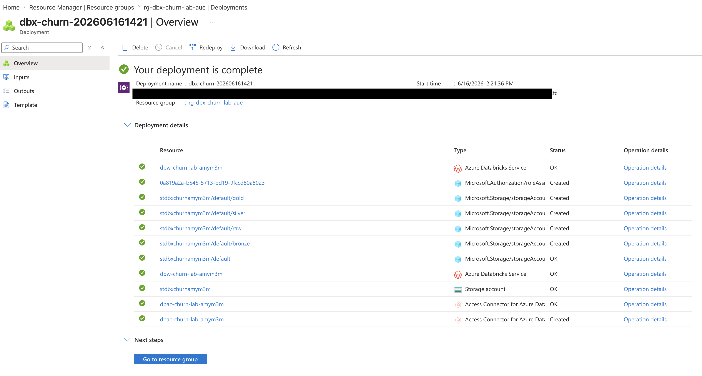 | 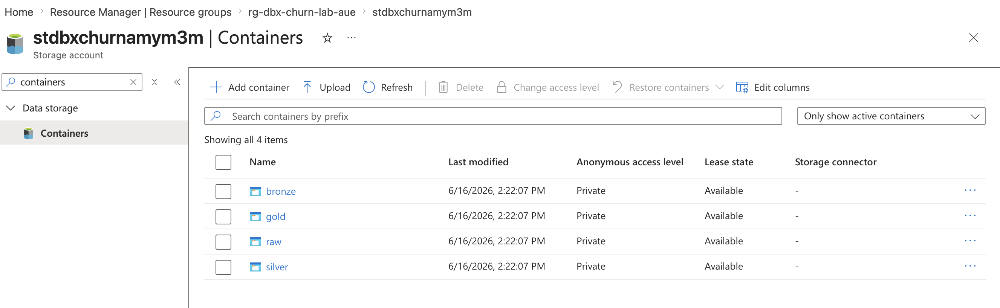 |

### Pipeline (Databricks)

| Single-node cluster config | Raw CSV uploaded to ADLS | Bronze ingest row count |
|---|---|---|
| 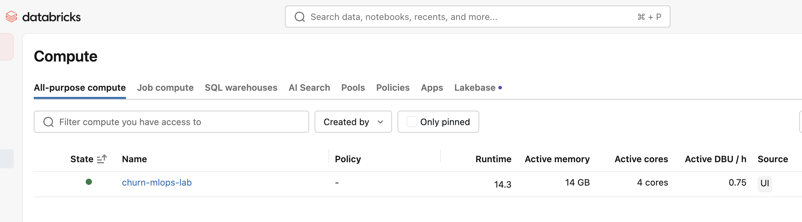 | 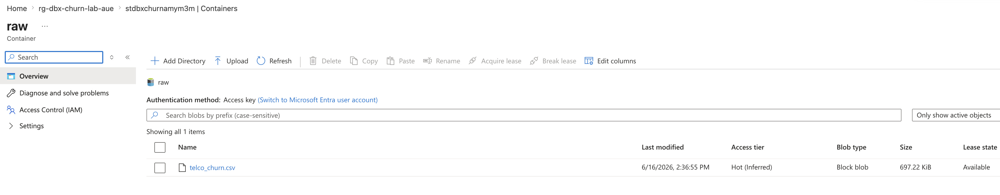 | 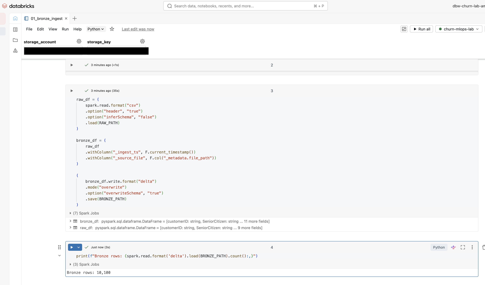 |

| Silver data-quality gates passed | Gold churn rate by tenure | Delta Lake time-travel history |
|---|---|---|
| 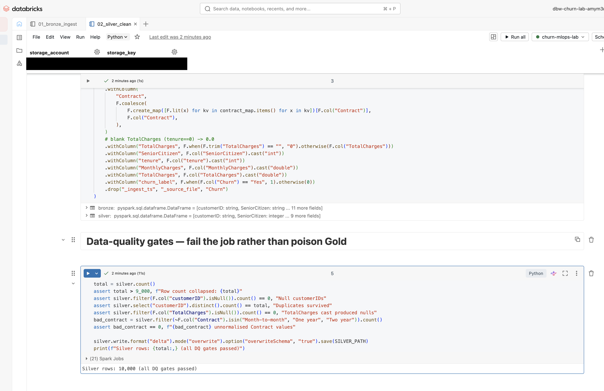 | 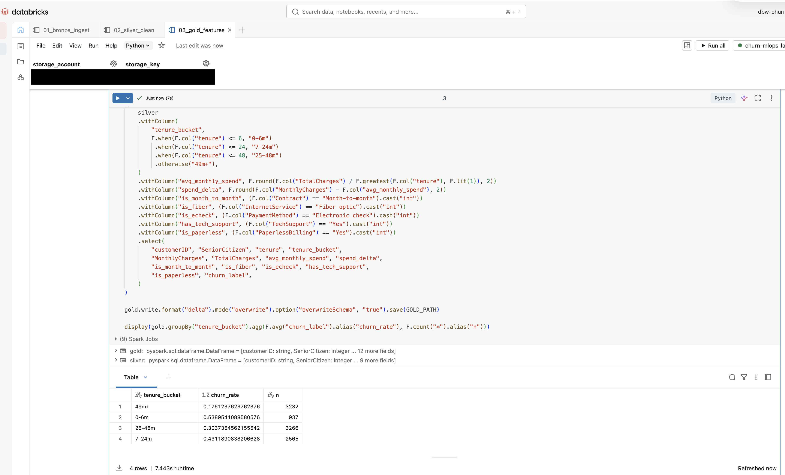 | 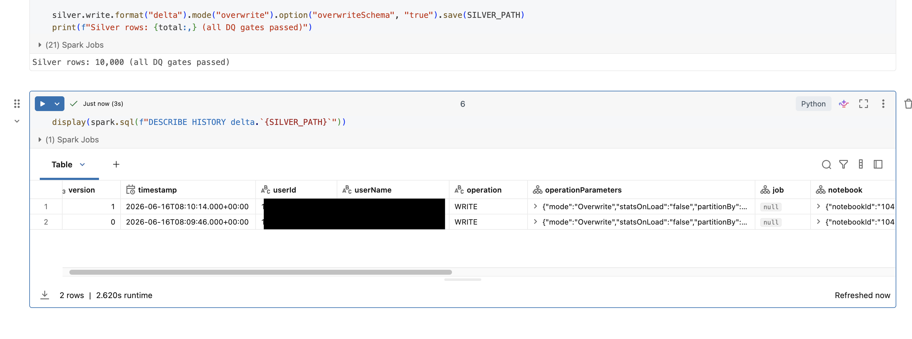 |

### Model lifecycle (MLflow + Unity Catalog)

| Experiment runs comparison | Best run detail | UC model registry (`@staging` alias) | Batch inference results |
|---|---|---|---|
| 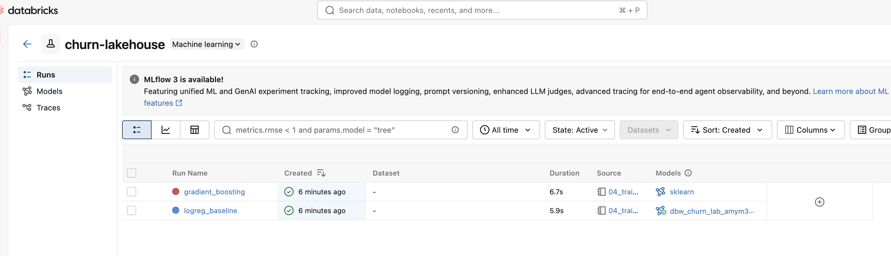 | 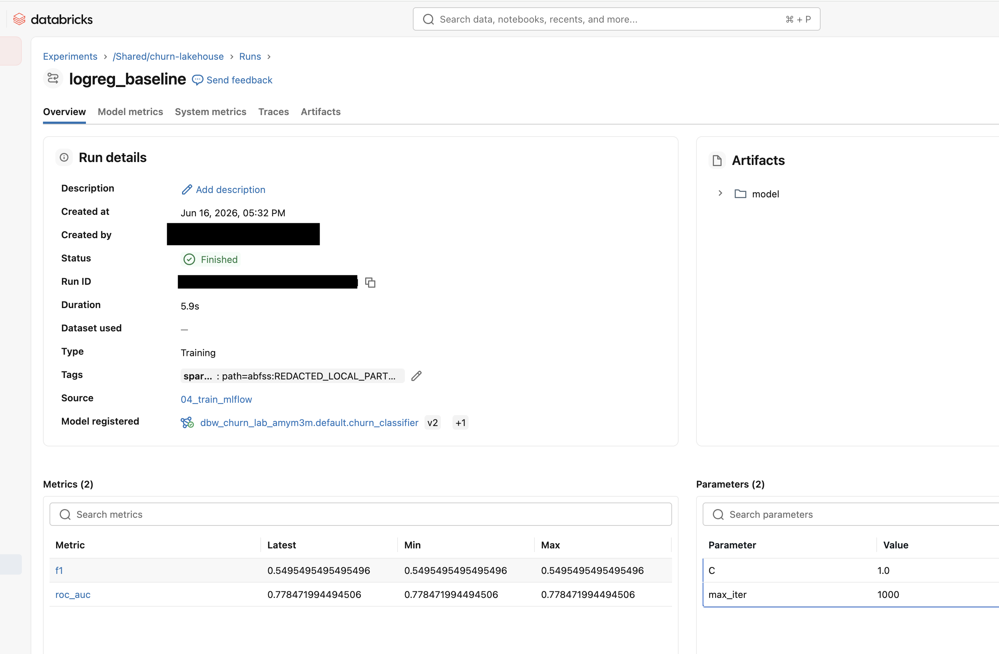 | 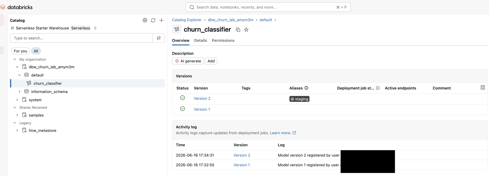 | 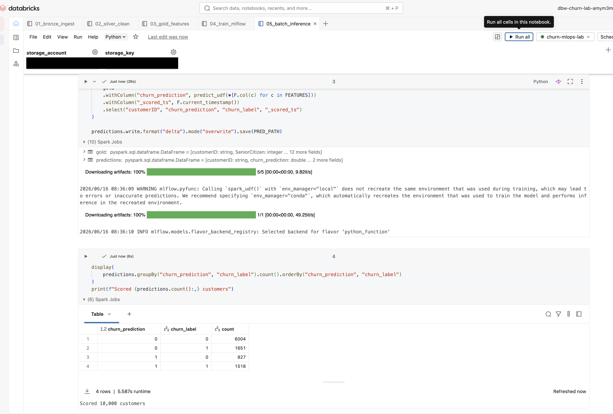 |

## Error report (in order encountered)

Failures hit while building this lab, with root cause and fix.

### 1 — pandas 3.0 `TypeError: Invalid value ' ' for dtype 'float64'` (`generate_churn_data.py`)
- **Symptom:** assigning the blank string `" "` into the float64 `TotalCharges` column during dirt injection.
  Trace: `LossySetitemError` → `coerce_to_target_dtype(raise_on_upcast=True)` → `TypeError`.
- **Cause:** local env is pandas 3.0.3. From pandas 3.x, a silent upcast (float→object) on dtype-mismatched
  assignment is forbidden; pandas 2.x only warned and let it through.
- **Fix:** cast first — `df["TotalCharges"] = df["TotalCharges"].astype(str)` before the assignment.

### 2 — Notebook 01 widget-parameter logic bug (design flaw, fixed before run)
- **Symptom:** the first draft of the storage-account parameter iterated an empty list in a meaningless
  conditional, so it always fell back to `CHANGE_ME`.
- **Fix:** replaced with the standard `dbutils.widgets.text()` + `dbutils.widgets.get()` pattern.
  Notebooks 02–05 used the correct pattern from the start.
