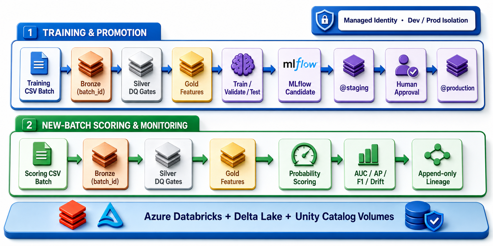
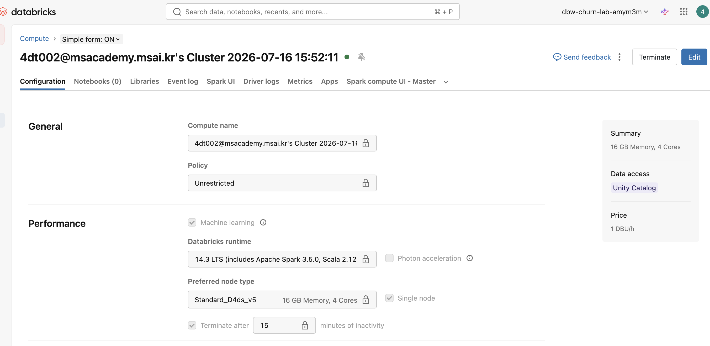
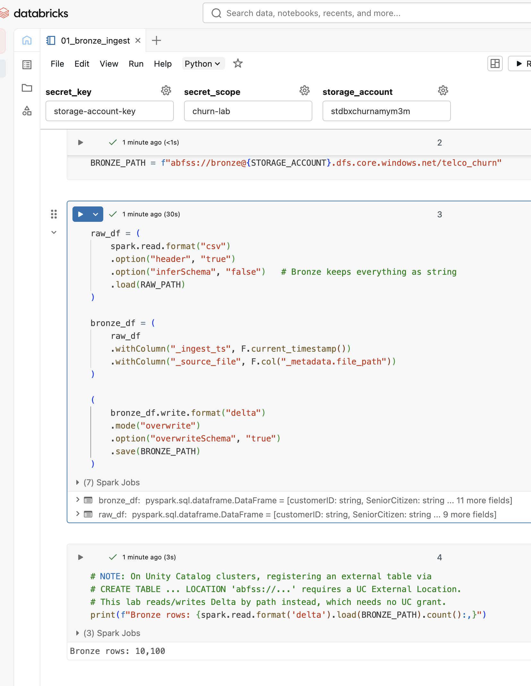
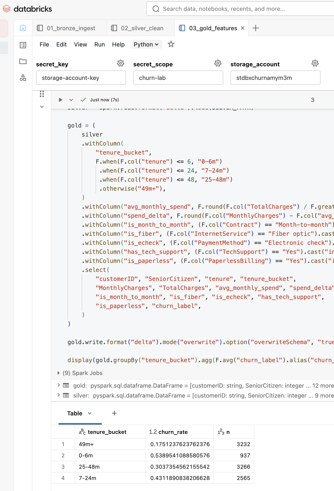
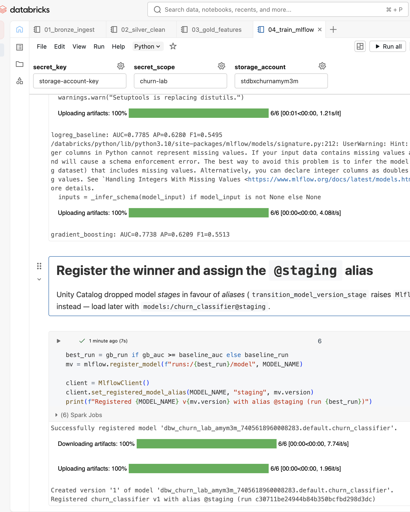
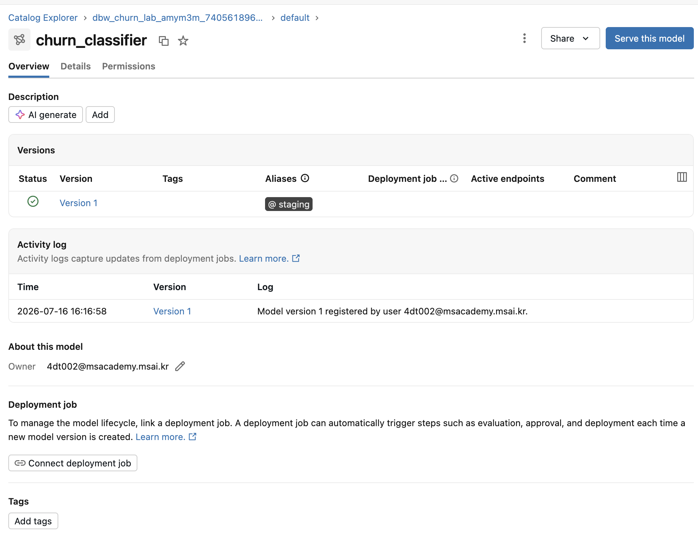
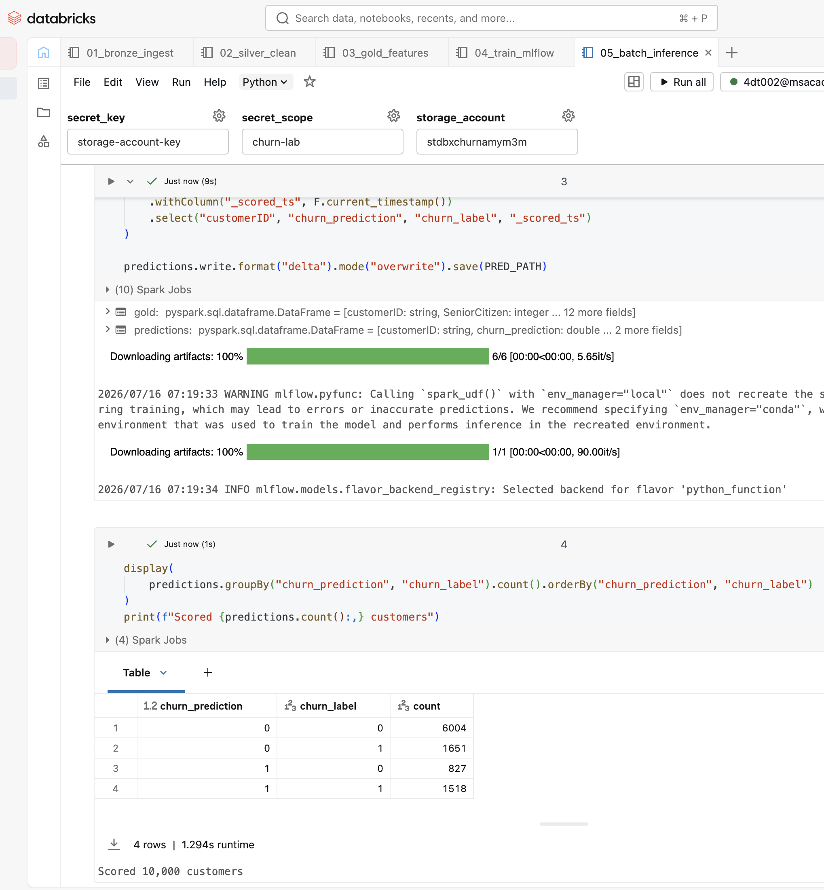
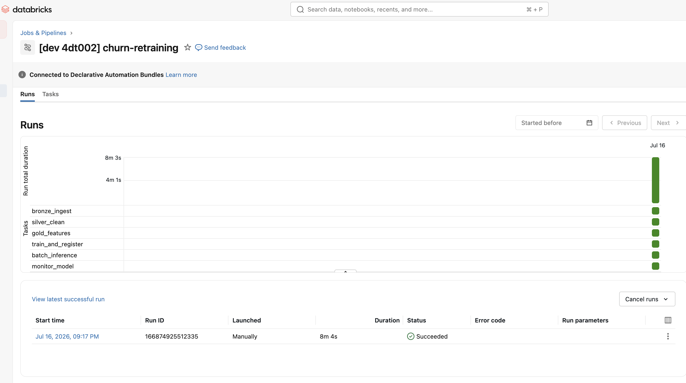

# Azure Databricks Lakehouse MLOps

[](https://github.com/danakim1004au-prog/databricks-lakehouse-mlops/actions/workflows/ci.yml)
[](https://github.com/danakim1004au-prog/databricks-lakehouse-mlops/actions/workflows/codeql.yml)
[](LICENSE)

An end-to-end customer-retention MLOps reference that separates training from new-batch scoring,
registers probability models in Unity Catalog, gates model promotion, and retains auditable data,
model, batch, and job lineage. The data is synthetic; the implementation focus is reproducibility,
failure gates, least privilege, cost control, and observable operational behaviour.



## Operational lifecycle

```text
Training CSV batch
  -> Bronze(batch_id) -> Silver contract gates -> Gold features(batch_id)
  -> train / validation / untouched test
  -> baseline vs challenger in MLflow
  -> absolute + champion non-regression gates
  -> @candidate -> @staging
  -> explicit approver job -> @production

New scoring CSV batch
  -> Bronze(batch_id) -> Silver -> Gold(batch_id)
  -> model @staging in dev / @production in prod
  -> probability + thresholded prediction
  -> labelled AUC, AP, F1, accuracy and feature-shift gates
  -> append-only monitoring history with full lineage
```

The retraining job never scores its own training batch. The daily job rebuilds an explicit scoring
batch before inference. For real churn outcomes, run monitoring only after delayed labels arrive;
the synthetic scoring batch includes labels so the complete control loop is reproducible.

## What is captured for every scored batch

| Field | Purpose |
|---|---|
| `batch_id`, `job_run_id`, `environment` | Identify the data and orchestrator run |
| `model_name`, `model_alias`, `model_version`, `model_run_id` | Reproduce the exact model |
| `gold_delta_version` | Anchor the input Delta snapshot |
| `decision_threshold` | Reproduce the operational class decision |
| `churn_probability`, `churn_prediction` | Support ranking and threshold changes |
| `scored_ts`, `monitored_ts` | Audit scoring and monitoring time |

## Repository layout

| Path | Purpose |
|---|---|
| `infra/main.bicep` | ADLS Gen2, Premium workspace, Access Connector, shared-key disablement |
| `infra/databricks/` | Metastore assignment, managed-identity credential, UC locations/volumes/grants |
| `databricks.yml` | Environment-isolated bundle targets and variables |
| `resources/churn_jobs.yml` | Retraining, scoring/monitoring, and manual promotion jobs |
| `src/databricks_lakehouse_mlops/` | Shared Pandas/Spark contracts and feature transforms |
| `notebooks/01...07` | Versioned ingest through explicit production promotion |
| `data/generate_churn_data.py` | Seeded, distinct training and shifted scoring batches |
| `tests/` | Failure-path, feature-contract, Spark, and bundle safety tests |
| `.github/workflows/` | CI, CodeQL, dependency audit, IaC, and optional bundle validation |
| `serving/databricks.yml` | Optional environment-tagged scale-to-zero endpoint |
| `docs/COST_ESTIMATE.md` | Cost assumptions and recurring-spend traps |

## Local quality gate

Python 3.10 or newer and Java 17 are required for the local Spark contract tests.

```bash
python3 -m venv .venv
source .venv/bin/activate
python -m pip install --upgrade pip
python -m pip install -r requirements-dev.lock
python -m pip install -e . --no-deps

python data/generate_churn_data.py
python -m pytest
python src/train_local.py
ruff check .
pip-audit -r requirements-dev.lock
```

The generated CSVs are ignored because both batches are deterministic. `requirements-dev.lock`
pins direct CI dependencies; Dependabot proposes reviewed updates.

### Deterministic local reference result

The current seeded local smoke run produced the following result on Python 3.12. These values are
sanity evidence rather than a production performance claim; Databricks MLflow remains the source
of record for workspace runs.

| Input/result | Value |
|---|---:|
| Training raw / deduplicated customers | 10,100 / 10,000 |
| Scoring raw / deduplicated customers | 2,525 / 2,500 |
| Selected candidate | Standardised logistic regression |
| Untouched-test ROC-AUC | 0.7865 |
| Untouched-test average precision | 0.6412 |
| Untouched-test F1 at threshold 0.50 | 0.5518 |

## 1. Deploy Azure resources

```bash
az login
./infra/deploy.sh
```

The Bicep deployment creates a disposable resource group, ADLS Gen2 containers, a Premium
workspace, and an Access Connector. Storage shared-key authentication is disabled; data access is
completed through Unity Catalog managed identity.

## 2. Bootstrap Unity Catalog

An existing regional Unity Catalog metastore and account-admin access are prerequisites. Copy the
example variables, fill the Bicep outputs and account identifiers, and apply the Databricks layer:

```bash
cd infra/databricks
cp terraform.tfvars.example terraform.tfvars
terraform init
terraform fmt -check
terraform plan
terraform apply
cd ../..
```

See [`infra/databricks/README.md`](infra/databricks/README.md) for the created security boundary.
Use separate principals and remote Terraform state in a long-lived tenancy.

## 3. Generate and upload distinct batches

Authenticate to the workspace with browser OAuth, then upload the two files to the raw external
volume. Repeat for `churn_prod` only when production testing is intentional.

```bash
databricks auth login --host https://<workspace-url> --profile churn-lab
export DATABRICKS_CONFIG_PROFILE=churn-lab

python data/generate_churn_data.py
databricks fs cp data/telco_churn_train.csv \
  dbfs:/Volumes/churn_mlops/churn_dev/raw/training/telco_churn_train.csv --overwrite
databricks fs cp data/telco_churn_scoring.csv \
  dbfs:/Volumes/churn_mlops/churn_dev/raw/scoring/telco_churn_scoring.csv --overwrite
```

## 4. Validate, deploy, and train

All bundle commands require a fully qualified Unity Catalog model and a real notification address.

```bash
databricks bundle validate -t dev \
  --var="catalog=churn_mlops" \
  --var="model_name=churn_mlops.churn_dev.churn_classifier" \
  --var="notification_email=<your-email>"

databricks bundle deploy -t dev \
  --var="catalog=churn_mlops" \
  --var="model_name=churn_mlops.churn_dev.churn_classifier" \
  --var="notification_email=<your-email>"

databricks bundle run -t dev churn_retraining \
  --var="catalog=churn_mlops" \
  --var="model_name=churn_mlops.churn_dev.churn_classifier" \
  --var="notification_email=<your-email>"
```

Model selection uses validation ROC-AUC. The untouched test set must meet ROC-AUC, average
precision, and F1 floors and may not regress materially against the current production champion.
A passing candidate updates `@candidate` and `@staging`; it does not update `@production`.

## 5. Score a new batch and monitor

```bash
databricks bundle run -t dev churn_batch_monitoring \
  --var="catalog=churn_mlops" \
  --var="model_name=churn_mlops.churn_dev.churn_classifier" \
  --var="notification_email=<your-email>"
```

Development scoring uses `@staging`; production scoring uses `@production`. Each run gets an
isolated batch path. Monitoring appends AUC, average precision, F1, accuracy, positive rate, and
maximum standardised feature-mean shift. Failed gates fail the job and trigger notifications.
An ingestion ledger rejects source files with an already processed path, modification time, and
size, so a schedule cannot silently append duplicate monitoring results. Upload a new dated file
or replace the scoring object before the next scheduled run.

## 6. Explicit production promotion

The promotion job has no schedule and requires both an approver and a literal confirmation token.
It verifies that the staging version has a passing gate record before moving `@production` and
appends a promotion audit record.

```bash
databricks bundle run -t dev churn_model_promotion \
  --params approved_by=<reviewer>,confirm=PROMOTE \
  --var="catalog=churn_mlops" \
  --var="model_name=churn_mlops.churn_dev.churn_classifier" \
  --var="notification_email=<your-email>"
```

For a real production release, deploy the `prod` target with
`churn_mlops.churn_prod.churn_classifier`, retrain/gate in that environment, and approve there.
This prevents dev data, aliases, Delta paths, experiments, and schedules from colliding with prod.

## Optional real-time serving

After approval, resolve the numeric version currently carrying `@production`, then deploy the
separate serving bundle. Keeping a numeric serving version makes a deployment immutable and makes
rollback explicit.

```bash
cd serving
databricks bundle deploy -t prod \
  --var="registered_model_name=churn_mlops.churn_prod.churn_classifier" \
  --var="model_version=<production-version>"
```

The endpoint is Small, environment-tagged, and scales to zero. Destroy it after the demonstration
because serving is billed independently from job compute.

## Quality, security, and cost controls

- Shared transformations prevent Pandas/Spark feature drift; CI runs the Spark functions directly.
- Invalid labels, contracts, ranges, schema changes, and conflicting duplicates fail before Gold.
- Job retries cover transient ingest/transform failures; duration and failure notifications are set.
- GitHub Actions are SHA-pinned; CodeQL, Dependabot, `pip-audit`, and coverage are enabled.
- Dev schedules are paused. Prod enables daily scoring and weekly retraining explicitly.
- Managed identity and UC volumes replace storage keys. Public networking remains a documented lab
  toggle, not an implied production default.
- Predictions are immutable per batch; monitoring and promotions are append-only audit histories.

## Verified evidence and current limitations

| Compute | Bronze | Gold |
|---|---|---|
|  |  |  |

| MLflow | Registry | Batch inference |
|---|---|---|
|  |  |  |

| Bundle workflow |
|---|
|  |

The screenshots demonstrate the earlier storage-key lab run and should be refreshed after the
managed-identity deployment. The current monitoring uses labelled synthetic batches and simple
standardised mean shift; production systems should add delayed-label orchestration, segment-level
drift, calibration, fairness review, alert routing, retention policies, and private networking.

## Teardown

Destroy optional serving first, destroy bundle-managed resources, then request Azure resource-group
deletion and verify completion:

```bash
databricks bundle destroy -t dev \
  --var="catalog=churn_mlops" \
  --var="model_name=churn_mlops.churn_dev.churn_classifier" \
  --var="notification_email=<your-email>"
RG=rg-dbx-churn-lab-aue ./infra/teardown.sh
az group exists --name rg-dbx-churn-lab-aue
```

See [`docs/COST_ESTIMATE.md`](docs/COST_ESTIMATE.md) and [`SECURITY.md`](SECURITY.md) before using
an unpaused target or leaving an endpoint deployed.
